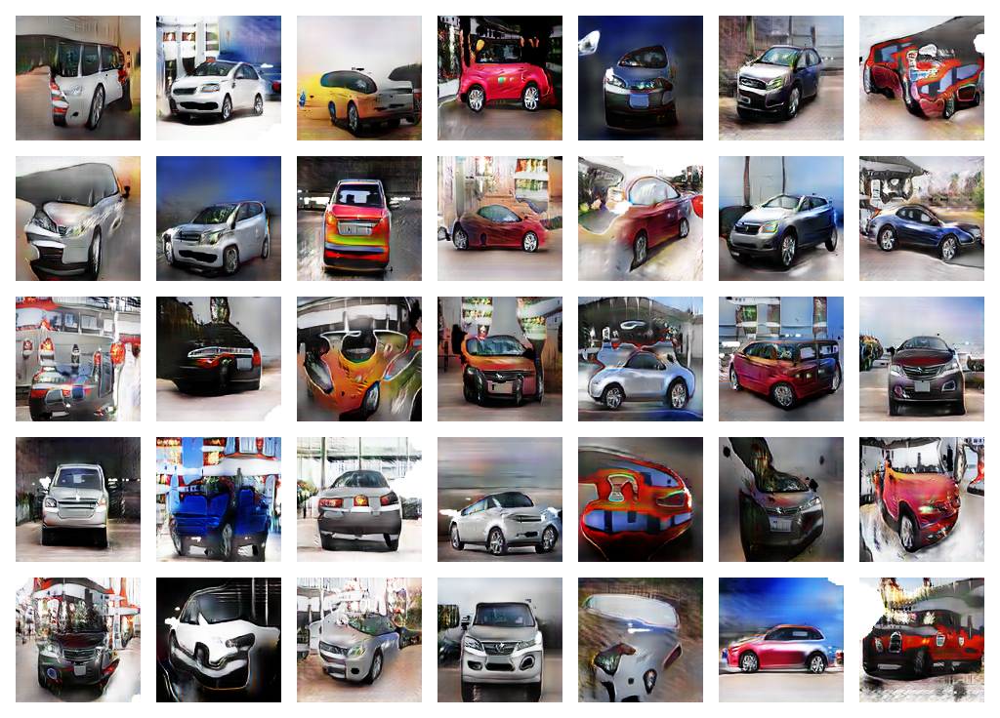

# GAN-Playground

## Introduction

This is a playground for experimenting with GANs. It is a collection of scripts that make it easy to train GANs for
image generation via TensorFlow.

After about 40 min of training (50 epochs // RTX3080) on
the [CUHK CompCars Dataset](https://www.kaggle.com/datasets/renancostaalencar/compcars),
a GAN was be able to generate images that look like this:



While these are obviously not real cars, you would most likely agree that some of these images are showing cars or something similiar to cars.
With additional training or adjustments to the model architecture, it should be performing better.
You can adjust the model architecture and hyperparameters in the `models.py` and `configuration.py` files.

## Installation

To install all relevant libraries, run the following command:

```bash
pip install -r requirements.txt
```

Once you are ready to go, create a `raw_data` folder at project root level and put the images in there. You can have
them placed in subfolders
as well and the dataset generator will automatically find them.

## Usage

To train a model you can edit `configuration.py` for your desired settings or leave them as is and run the main script:

```bash
python main.py
```

A number of images will be generated within each epoch and saved to the `image_output` folder.
After the completion of a training, both the generator and the discriminator will be saved to the `saved_models` folder.
You can then use the saved models to generate new images after loading them with `tf.keras.models.load_model`.
